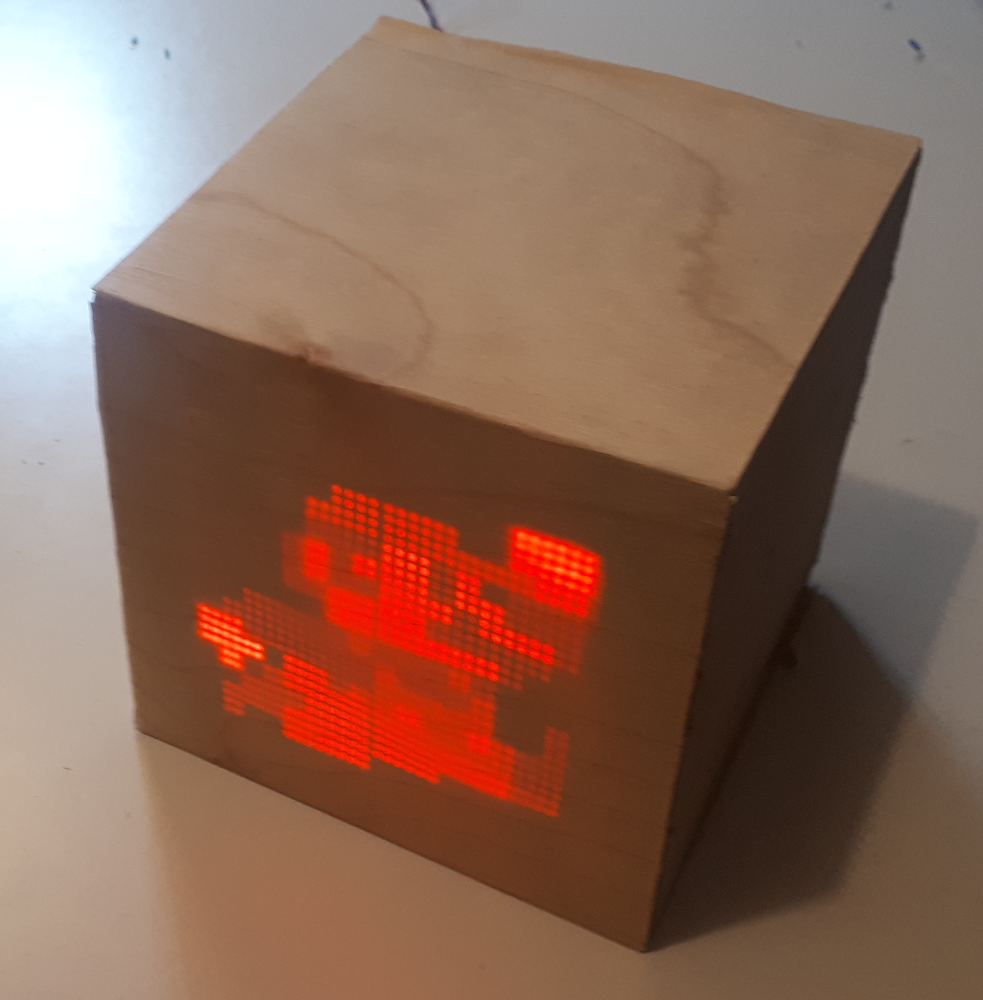

# PROJECT IN PROGRESS #



A seamless wooden cube with invisble (when turned off) screen.

## how to compile ##

### prerequisites ###

* python >= 3.6
* arm_none_eabi_gcc

### compilation ###

```
git clone https://github.com/ProrokWielki/Wooden-Clock.git
git submodule update --init

pip install py_buildsystem

cd Software/config/py_buildsystem

py_buildsystem -pcc G++_ARM_Config.yaml -pc WoodenClock.yaml
```